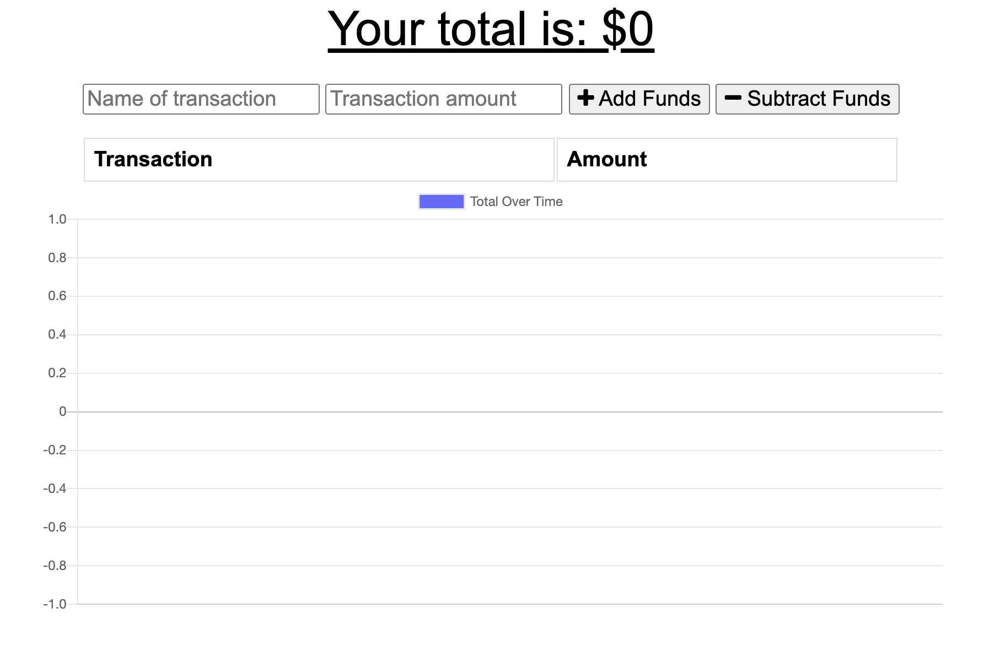

# Progressive-Budget
  ## Description
  Add functionality to our existing Budget Tracker application to allow for offline access and functionality. The user will be able to add expenses and deposits to their budget with or without a connection. When entering transactions offline, they should populate the total when brought back online.

  ## Table of Content
  * [Installation](#installation)
  * [Finished_Requirements](#finished_Requirements)
  * [Screenshots](#screenshots)
  * [Live](#live)

  ## Installation
  Clone the repository from GitHub. First install all required dependencies by `npm i`. Run `node server.js` to connect the server. 
  
  ## Finished_Requirements
  Offline Functionality:

  * Enter deposits offline

  * Enter expenses offline

  When brought back online:

  * Offline entries should be added to tracker

  ## Screenshots
  

  ## Live
  [heroku](https://whispering-mountain-40567.herokuapp.com/)

  